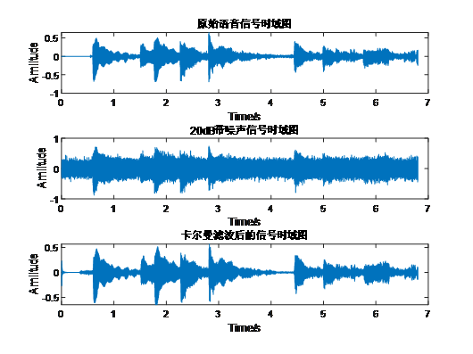
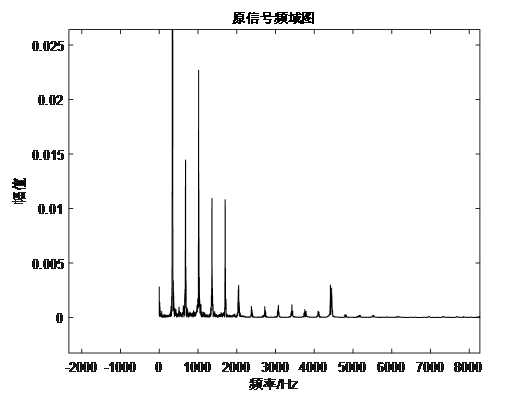
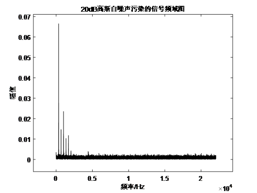
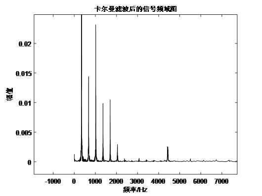

# Noise-Reduction-DSP

> 本项目分别采用不同窗函数设计的低通滤波器和卡尔曼滤波器对经过高斯白噪声全频段污染的语音信号进行去噪

### 一、动机

​		在issue_1中采用低通滤波器可以较好的滤除高斯白噪声中大部分的高频段成分，并保留原始信号的频率成分。其中，布莱克曼窗函数设计的低通滤波器相较于矩形窗函数设计的低通滤波器，在过度带宽具有更好的频率截断特性，同时在更高频段处频率响应的波浪起伏总体趋势向下，保证了在高频段处依然可以保证衰减倍数较大，不会保留高频段成分的小强度响应。<u>显然采用布莱克曼窗函数设计的低通滤波器在语音去噪上性能更优越。</u>

​		然而，<u>低通滤波器去噪并不能区分低频段处的噪声和原信号频率成分，无法实现低频段处的高斯白噪声也较好滤除的效果，导致去噪后的语音信号仍然带有嘈杂的噪声成分。</u>因此在issue_2中采用卡尔曼滤波器尝试将全频段的高斯白噪声去除。

​		参考《机器人学中的状态估计》一书第三章线性高斯系统，其中用最大后验估计的思想推导了线性高斯系统的状态估计问题实际上是最小二乘法问题，最终的优化求解方程为线性方程。书中针对离散、递归的情况，利用Cholesky法、RTS平滑算法进行求解，并继续推导出了<u>卡尔曼滤波器给出了线性高斯系统下的最优线性无偏估计的结论。</u>

​		本项目中语音信号中加入的噪声为高斯白噪声，并且如果将原始语音信号建模为线性模型，则可以列写一个线性且高斯的状态空间方程。这样就利用卡尔曼滤波实现对信号的最佳线性无偏估计，从而去除高斯噪声的影响。

### 二、卡尔曼滤波器设计思路

#### 1.语音信号分帧

​		从导入的原始信号时域图可以很容易观察得到，对一整个信号进行线性建模是很困难的。本文利用分帧将语音信号分为若干帧，对每个帧进行线性建模则容易得多。分帧可以保证每一帧帧内信号是平稳的，即一帧的长度约为一个音素的长度。

​		若帧内信号为平稳信号，则可以利用AR模型对各个帧都进行线性建模了。在这里分帧操作不需要额外进行加窗。

#### 2.原信号线性建模

​		本文利用AR模型，将一帧的每一个样本点信号看作是前面信号经过一个系统后响应的加权线性组合。为了尽可能的用线性方程对原信号进行拟合，本例中使用400阶的AR模型对每一帧语音信号建模。线性方程建模公式如下：
$$
x(k)=\sum_{i=1}^{400} a_{i}(k) x(k-i)+w(k)
$$
​		其中 $k$ 代表第几个样本点，$ a_{i}(k) x(k-i)+w(k)a_{i}(k), i=1,2,3 \ldots 400$ 代表模型系数，$ w(k)$代表高斯白噪声。

​		对原信号利用LPC线性预测算法求解线性系数以及模型的方差，这个方差$ w(k)$可以作为卡尔曼滤波过程中线性状态方程的过程噪声来使用，以描述对AR线性模型的信赖程度。

​		对每一帧的语音信号都进行AR模型建模，这样便可以得到每一帧的状态方程线性系数以及过程噪声。

```matlab
%% 线性建模
AR_order = 400; %AR模型阶数 400阶线性模型
[AR_coeff, Q] = lpc(source_frame', AR_order); %每帧原始语音的AR模型系数arCoeff和过程噪声方差Q
```

#### 3.卡尔曼滤波参数初始化

​		在本例中对每一帧的语音信号列写离散线性高斯系统的状态方程和观测方程为：
$$
\begin{array}{l}
X(k)=A \cdot X(k-1)+w(k) \\
y(k)=H \cdot X(k)+v(k)
\end{array}
$$
​		其中$w(k)$为线性模型的过程噪声，$v(k)$为带噪信号的观测噪声。系统的状态变量即样本点信号值为：
$$
X(k)=[x(k-p+1), x(k-p+2), \cdots x(k)]^{T}
$$
​		系统的系数矩阵为：

$$
A(k)=\left[\begin{array}{cccc}
0 & 1 & \cdots & 0 \\
\vdots & \vdots & \vdots & \vdots \\
0 & 0 & \cdots & 1 \\
a_{400}(k) & a_{399}(k) & \cdots & a_{1}(k)
\end{array}\right]
$$
​		系统的观测矩阵为：

$$
H(k)=[0,0,0, \cdots 1]_{1 \times 400}
$$
​		观测噪声初始化为观测方程中的高斯白噪声$v(k)$，后验估计的误差协方差矩阵初始化也初始化为观测噪声$v(k)$，信号的后验估计初始化为第一帧的前400个样本点。

```matlab
%% 初始化参数
H = [zeros(1, AR_order - 1), 1]; %观测矩阵
R = var(noise_signal); %测量噪声方差
P = R * eye(AR_order); %后验估计误差协方差矩阵初始化为测量方程噪声方差
Est_filter_signal = noise_signal(1 : AR_order,1); %初始化后验估计
filter_signal = zeros(1, length(noise_signal)); %为输出信号分配内存
filter_signal(1:AR_order) = noise_signal(1 : AR_order, 1)'; % 初始化输出信
```

#### 4.卡尔曼滤波递归过程

​		卡尔曼滤波器用反馈控制的方法估计过程状态：线性状态方程估计过程某一时刻的状态，然后以（含噪声的）测量变量的方式获得反馈。因此卡尔曼滤波器可分为两个部分：模型更新方程和测量校正方程。

​		模型更新方程负责及时向前推算当前状态变量和误差协方差估计的值，为下一个时间状态构造先验估计。测量校正方程负责将先验估计和新的测量值结合以构造校正后的后验估计。

​		模型更新方程为：

$$
\begin{array}{l}
\hat{X}(k)=A \hat{X}(k-1) \\
\hat{P}(k)=A \breve{P}(k-1) A^{T}+H Q H^{T}
\end{array}
$$
​		测量校正方程为：

$$
\begin{array}{l}
K(k)=\hat{P}(k) H^{T}\left(H \hat{P}(k) H^{T}+R\right)^{-1} \\
\breve{X}(k)=\hat{X}(k)+K(k)(y(k)-H \hat{X}(k)) \\
\breve{P}(k)=(I-K(k) H) \hat{P}(k)
\end{array}
$$
​		其中$\hat{X}(k)$为$k$时刻的先验估计，$\breve{X}(k)$为$k$时刻的后验估计，$\hat{P}(k)$为先验估计误差的协方差矩阵，$\breve{X}(k)$后验估计误差的协方差矩阵，$K(k)$为卡尔曼增益，$Q$和$R$分别为$w(k)$和$v(k)$的协方差矩阵。

​		根据上面的公式，写出每一个分帧内若干样本点的卡尔曼递归过程:

```matlab
%% 卡尔曼滤波过程
for k = 1:frame_num %对每一帧进行卡尔曼滤波
	% 初始化开始进行卡尔曼滤波的位置
	if k == 1 
		iiStart = AR_order + 1; %如果是第一帧，则从第arOrder+1个点开始处理
	end
	%得到当前帧的信号状态方程的系数矩阵A
	A = [zeros(AR_order - 1, 1), eye(AR_order - 1); fliplr(-AR_coeff(k, 2 : end))]; % fliplr:左右翻转
	for ii = iiStart : frame_sample
		% 计算先验估计
		aheadEstOutput = A * Est_filter_signal; 
		% 计算先验估计误差的协方差矩阵p-
		aheadErrCov = A * P * A' + H' * Q(k) * H;
		% 计算卡尔曼增益
		K = (aheadErrCov * H') / (H * aheadErrCov * H' + R);
		% 计算后验估计
		Est_filter_signal = aheadEstOutput + K * (frame_signal(k, ii) - H * aheadEstOutput);
		% 更新输出结果
		index = ii - iiStart + AR_order + 1 + (k - 1) * frame_sample;
		filter_signal(index - AR_order + 1 : index) = Est_filter_signal';
		% 计算后验估计误差的协方差矩阵p
		P = (eye(AR_order) - K * H) * aheadErrCov;
	end
	iiStart = 1;
end
filter_signal = filter_signal';
```

### 三、结果

***这里主要展示卡尔曼滤波器的效果，就不展示低通滤波器的结果了，可以自行下载代码跑结果看看。***

- 原始信号、20dB带噪信号以及卡尔曼滤波后信号的时域图比较：

  

- 原信号频域图（放大低频部分观察）

  

- 20dB高斯白噪声污染的信号频域图

  

- 卡尔曼滤波后的信号频域图（放大低频部分观察）

  

### 四、程序文件说明

#### 1.issue_1中的文件：

- FIR_design.m ————> 利用窗函数设计FIR滤波器的主程序
- Ideal_lpf.m ————> 理想低通滤波器的函数实现
- noisesignal_figure.m ————> 画出六种不同信噪比高斯白噪声污染后的信号时域图和频域图
- blackman_figure.m ————> 画出布莱克曼窗函数设计的LPF对语音信号去噪结果的函数
- box_figure.m ————> 画出矩形窗函数设计的LPF对语音信号去噪结果的函数
- newgaoshan.wav ————> 导入的原始语音信号
- Noise_reduction ————> 文件下存储着6种不同信噪比噪声利用lpf去噪后的语音
- Noise_signal ————> 文件下存储着6种不同信噪比高斯白噪声下受污染的语音

#### 2.issue_2中的文件：
- KF_denoise.m ————> 设计卡尔曼滤波器对语音信号进行降噪，希望将低频段的高斯白噪声也滤除
  			            运行时间将近1小时！！！！
- newgaoshan.wav ————> 导入的原始语音信号
- Noise_20dB.wav ————> 20dB高斯白噪声污染信号的语音
- Noise_reduction_20dB.wav ————> 卡尔曼滤波对20dB高斯白噪声进行去噪后的语音

